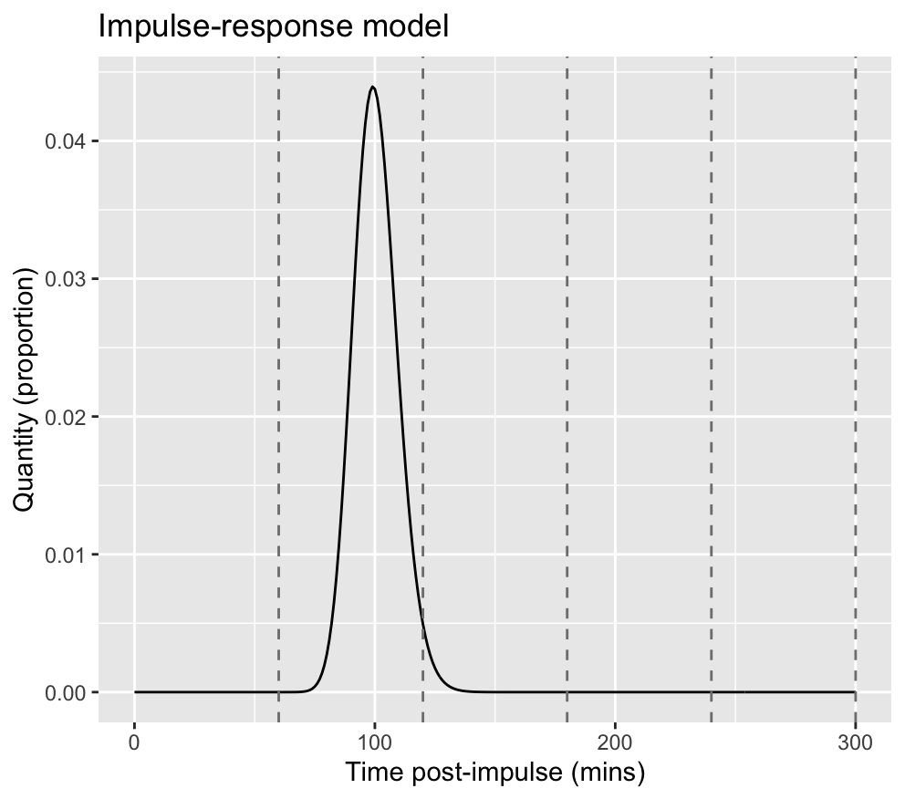
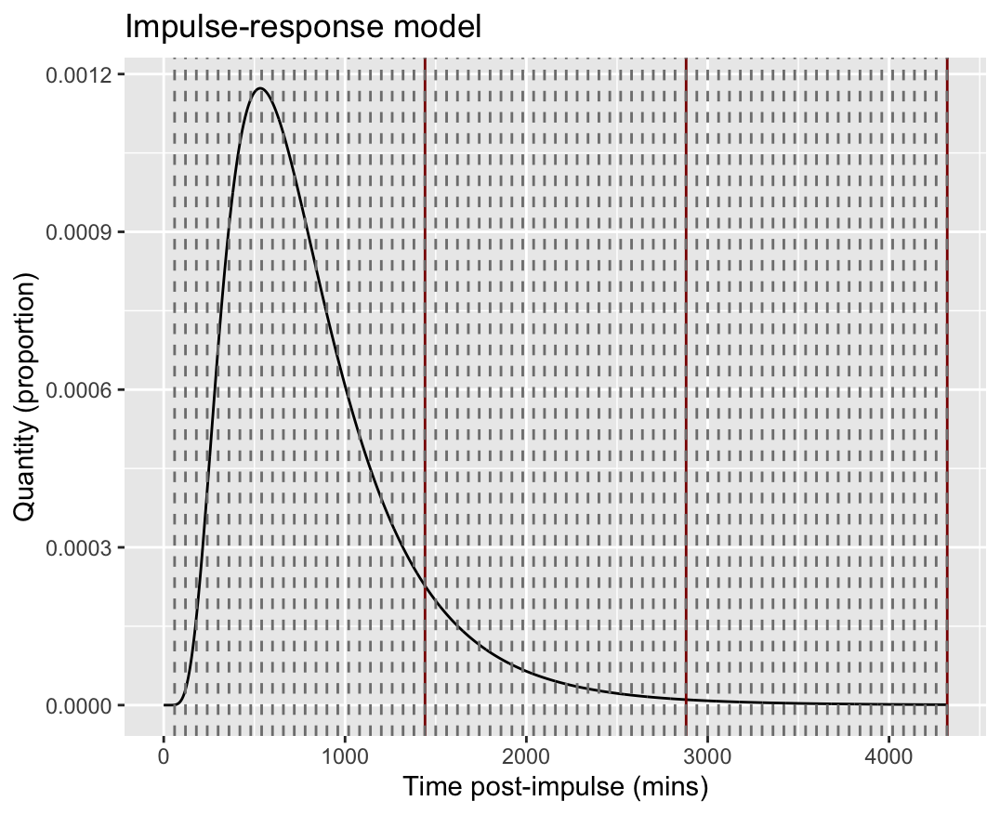

# Spiking Experiment in Wastewater

## Summary

## Project Aims

1. Support the sampling methods and analysis for the spiking of viruses into wastewater
2. Identify the size of the inoculum and the number of samples required to estimate key parameters

## Introduction

The paper by Sheridan describes different models that are used to describe the hydraulic behaviour of constructed wetlands.
Here we assume that these models can also be used to model hydraulic behaviour of sewerage systems. 
We focus on using the 'impulse-tracer' model, as we are interested in the period of delay between an impulse 
and detection, the distribution of residence time, and examine evidence for decay of an impulse within the sewer system.

## Initial modelling

 Figure 1 shows a simple impulse and assumed residence time of the substance (assuming a log-normal distribution with mean 100 and variance 1.2 minutes).
The _area under the curve_ is equal to 1.00 and this is modelled on a continuous time scale. To estimate the residence time distribution (RTD), we want to obtain reliable estimates of
the mean and variance of the distribution, based on estimating these parameters from wastewater samples.

### Example 1.

In this example we plan to take hourly samples for the first day (n=6), followed by x2 samples on the second and third day post-impulse, totalling 10 samples.
An example is given below with a mean of 12 hours and variance 30 mins.

